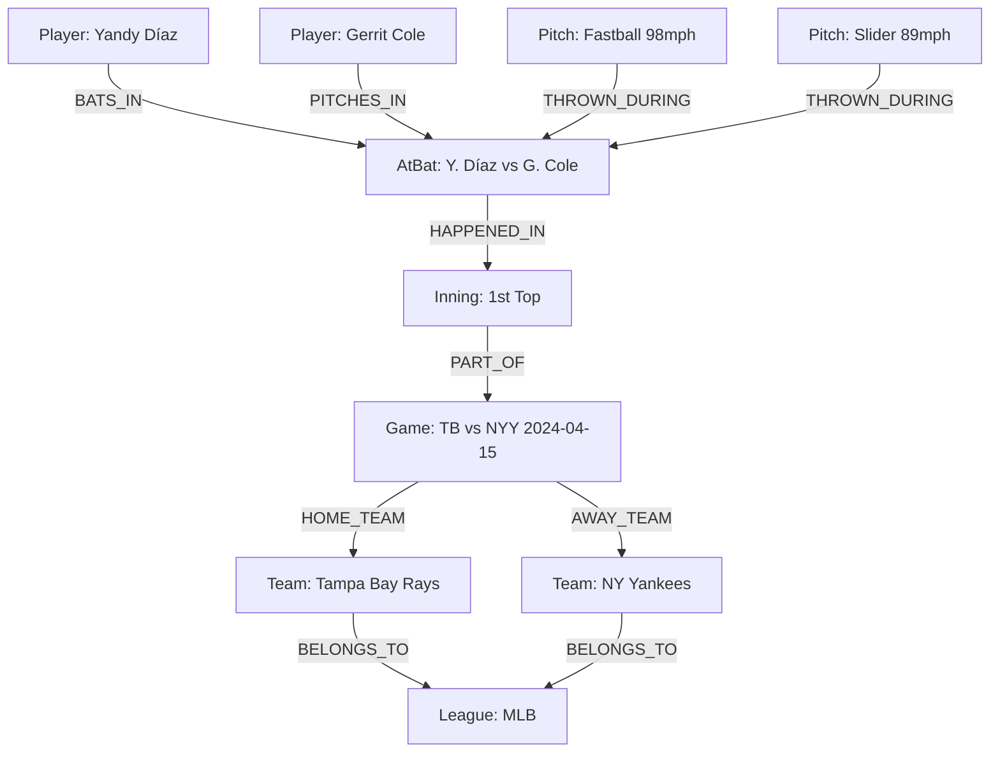
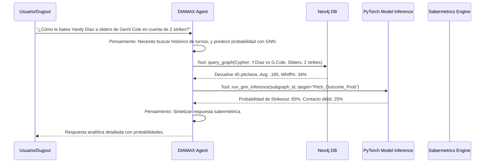

# DIAMAX PRO: Diseño Técnico Detallado - GNN y Agente de IA

> [!IMPORTANT]
> Documento Confidencial - 3Tree Digital Sport IA
> Preparado para: CEO Alí Zapata

Este documento detalla la arquitectura técnica de las Redes Neuronales de Grafo (GNN) y el Agente Autónomo de Inteligencia Artificial para **DIAMAX PRO**, enfocándose exclusivamente en el análisis de datos estructurados de béisbol y sabermetría.

---

## 1. Diseño del Grafo de Conocimiento Béisbol

El núcleo analítico de DIAMAX PRO es un Knowledge Graph (Grafo de Conocimiento) que modela la compleja interdependencia del ecosistema del béisbol.

### Schema de Nodos y Propiedades

| Tipo de Nodo | Propiedades Clave |
| :--- | :--- |
| **Player** | `player_id`, `name`, `dob`, `position`, `height`, `weight`, `bat_side`, `throw_side` |
| **Team** | `team_id`, `name`, `abbreviation`, `city` |
| **League** | `league_id`, `name`, `country`, `level` (MLB, MiLB, NPB, LVBP, etc.) |
| **Season** | `year`, `start_date`, `end_date` |
| **Game** | `game_id`, `date`, `weather`, `temperature`, `stadium` |
| **Inning** | `number`, `top_bottom` |
| **AtBat** | `atbat_id`, `balls`, `strikes`, `outs`, `event` (Strikeout, HR, Groundout), `sabermetrics` |
| **Pitch** | `pitch_id`, `pitch_type` (FF, SL, CH), `release_speed`, `spin_rate`, `pfx_x`, `pfx_z`, `zone` |
| **Sabermetric**| `type` (WAR, FIP, wOBA, BABIP), `value`, `calculated_at` |
| **City/Country**| `name`, `timezone` |

### Schema de Aristas (Relaciones)

- `(Player)-[PLAYS_FOR {start_date, end_date}]->(Team)`
- `(Team)-[BELONGS_TO]->(League)`
- `(Game)-[PLAYED_IN]->(Season)`
- `(Game)-[AWAY_TEAM/HOME_TEAM]->(Team)`
- `(Inning)-[PART_OF]->(Game)`
- `(AtBat)-[HAPPENED_IN]->(Inning)`
- `(Player:Batter)-[BATS_IN]->(AtBat)`
- `(Player:Pitcher)-[PITCHES_IN]->(AtBat)`
- `(Pitch)-[THROWN_DURING]->(AtBat)`
- `(Player)-[HAS_STAT {season}]->(Sabermetric)`

### Mermaid: Subgrafo de Ejemplo



---

## 2. Arquitectura GNN Completa

Para capturar las dinámicas de tipos de nodos variados, utilizaremos **Heterogeneous Graph Neural Networks (HeteroGNN)**. Específicamente, una arquitectura basada en **Heterogeneous Graph Attention Networks (HAN)** o **HGT (Heterogeneous Graph Transformer)** para manejar la secuencia temporal de pitcheos y turnos al bate.

> [!TIP]
> HGT es altamente recomendado para el béisbol porque permite aprender mecanismos de atención específicos de las relaciones (e.g., la atención de Pitcher -> AtBat es diferente a Batter -> AtBat).

### Arquitectura de Capas

1. **Feature Embedding Layer**: Proyecta características continuas (velocidad, spin rate, WAR) y categóricas (tipo de pitcheo, posición) a un espacio de embedding latente del mismo tamaño ($d=128$).
2. **HGT Layers (3 capas)**: Propaga mensajes a través de metapaths (e.g., Batter -> AtBat <- Pitcher).
3. **Temporal Readout/Pooling**: Pooling atencional sobre secuencias temporales (pitcheos en un turno, turnos en un juego).
4. **Task-Specific MLPs**:
   - Predicción de Rendimiento (Link Prediction entre Player y Sabermetric futura).
   - Predicción de Pitch (Node Classification en el próximo nodo Pitch a crear).

### Pipeline de Entrenamiento

- Extracción de datos de Neo4j en subgrafos estáticos (por juego o mes) para entrenamiento con `PyG` DataLoaders (e.g., `NeighborLoader`).
- Pérdida (Loss): Cross-Entropy para predicción de pitcheos, Huber Loss para proyecciones continuas (e.g., WAR).
- Optimizador AdamW, Learning Rate Scheduler con Warmup.

### Pseudocódigo PyTorch Geometric (PyG)

```python
import torch
import torch.nn.functional as F
from torch_geometric.nn import HGTConv, Linear

class DiamaxHeteroGNN(torch.nn.Module):
    def __init__(self, hidden_channels, out_channels, num_heads, num_layers, metadata):
        super().__init__()
        self.lin_dict = torch.nn.ModuleDict()
        for node_type in metadata[0]:
            # Proyección inicial para manejar diferentes tamaños de features
            self.lin_dict[node_type] = Linear(-1, hidden_channels)
            
        self.convs = torch.nn.ModuleList()
        for _ in range(num_layers):
            conv = HGTConv(hidden_channels, hidden_channels, metadata, num_heads)
            self.convs.append(conv)
            
        # MLP para predicción de rendimiento (ej: OBP proyectado)
        self.mlp_batter = torch.nn.Sequential(
            Linear(hidden_channels, hidden_channels // 2),
            torch.nn.ReLU(),
            Linear(hidden_channels // 2, out_channels)
        )

    def forward(self, x_dict, edge_index_dict):
        # 1. Feature Embedding
        x_dict = {
            node_type: self.lin_dict[node_type](x).relu_()
            for node_type, x in x_dict.items()
        }
        
        # 2. HGT Layers
        for conv in self.convs:
            x_dict = conv(x_dict, edge_index_dict)
            x_dict = {key: x.relu() for key, x in x_dict.items()}
            
        # 3. Readout para predicción de bateadores
        out_batter = self.mlp_batter(x_dict['Player'])
        return out_batter
```

---

## 3. Diseño del Agente Autónomo de IA

El Agente DIAMAX es una entidad basada en LangGraph / ReAct, capaz de planificar, usar herramientas y razonar sobre el grafo de conocimiento.

### Arquitectura ReAct



### Herramientas del Agente (Tools)

1. `query_graph(cypher_query: str) -> dict`: Ejecuta consultas estructuradas directas en Neo4j.
2. `run_gnn_inference(subgraph_data: dict, task: str) -> dict`: Llama al servicio de inferencia GNN.
3. `calculate_sabermetrics(player_id: str, season: str) -> dict`: Calcula stats dinámicos (wRC+, xFIP) en cortes específicos.
4. `compare_players(player_ids: list, metric: str) -> dict`: Compara métricas específicas entre jugadores.
5. `league_trends(league_id: str, season: str) -> dict`: Analiza tendencias macro de la liga.

### Ejemplo de Cypher Query

Generado dinámicamente por el agente:

```cypher
// Buscar todos los turnos al bate de Yandy Díaz vs Gerrit Cole
MATCH (b:Player {name: "Yandy Díaz"})-[r1:BATS_IN]->(ab:AtBat)<-[r2:PITCHES_IN]-(p:Player {name: "Gerrit Cole"})
MATCH (ab)-[:THROWN_DURING]-(pitch:Pitch {pitch_type: "SL", strikes: 2})
RETURN pitch.release_speed, pitch.zone, pitch.event
```

---

## 4. Feature Engineering Béisbol

### Features a Nivel Nodo (Structured Inputs)

- **Pitch Node**: `[velocidad_normalizada, spin_rate_norm, pfx_x, pfx_z, zone_one_hot (14 dim), ball_count, strike_count, release_extension]`
- **Player (Pitcher)**: Histórico acumulado `[K/9, BB/9, HR/9, xFIP, ground_ball_pct, velocity_percentile, fatigue_index]`
- **Player (Batter)**: `[wOBA, wRC+, ISO, BABIP, chase_rate, contact_rate, hard_hit_pct, launch_angle_avg, bat_speed_avg]`
- **Game/Context**: `[inning, run_differential, men_on_base_one_hot (8 dim), outs, park_factor_hr]`

### Embeddings

- **Node Embeddings**: Extraídos de las capas ocultas de la GNN para calcular similitud de jugadores usando distancia del coseno.
- **League & Team Embeddings**: Capturan características macro y "tenant isolation".

> [!WARNING]
> Multi-Tenant Isolation: Las ligas (MLB vs LVBP) tienen escalas estadísticas muy diferentes. El modelo GNN debe incluir el League Embedding como condition feature para evitar contaminación cruzada de proyecciones, o entrenar modelos separados por tenant.

---

## 5. API de Inferencia

Para operaciones en el Dugout, la latencia es crítica. Se divide en Batch (cálculos de la mañana) y Real-Time (durante el juego).

### Endpoints REST (FastAPI)

- `POST /api/v1/agent/query`: Endpoint principal de NLP para el Agente ReAct.
- `POST /api/v1/gnn/predict/pitch-sequence`: Predice el tipo y ubicación del próximo pitcheo basado en el estado actual del AtBat.
- `GET /api/v1/players/{id}/embeddings`: Recupera representaciones latentes pre-calculadas.
- `POST /api/v1/sabermetrics/calculate`: Ejecución bajo demanda de cálculos matemáticos.

### Optimización de Latencia (Real-Time Inference)

- **TensorRT / ONNX**: El modelo PyG debe ser exportado a ONNX o TensorRT.
- **Latencia esperada**: `< 50ms` para inferencia GNN, `< 1.2s` para respuesta completa del Agente.

---

## 6. Estimación de Costos ML

### Training Pipeline

- **Infraestructura**: GCP Vertex AI o AWS SageMaker.
- **Hardware**: 1x NVIDIA A100 (40GB) por liga mayor (el dataset de Statcast desde 2015 es masivo).
- **Tiempo estimado**: 12-24 horas de entrenamiento por época para todo MLB.
- **Costo**: ~$4/hr por GPU A100. Total estimado: ~$200 por corrida completa.
- **Almacenamiento y Versionado**: MLflow y Weights & Biases (W&B) para el tracking de experimentos.

### Inference & Hosting

- **API Agent**: CPUs escalables (EKS/GKE). Costo bajo.
- **Graph Database**: Neo4j AuraDB Enterprise. Costo predominante (escalable según el tamaño de la liga y retención de memoria).
- **GNN Inference**: NVIDIA T4 (bajo costo, excelente para inferencia) o inferencia CPU con ONNX si los subgrafos son pequeños. ~$0.35/hr por instancia T4.

> [!CAUTION]
> El almacenamiento del grafo de todos los pitcheos históricos (varios millones por temporada en MLB) requiere escalamiento horizontal de la base de datos de grafos.

---
_Documento generado para DIAMAX PRO - 3Tree Digital Sport IA._
