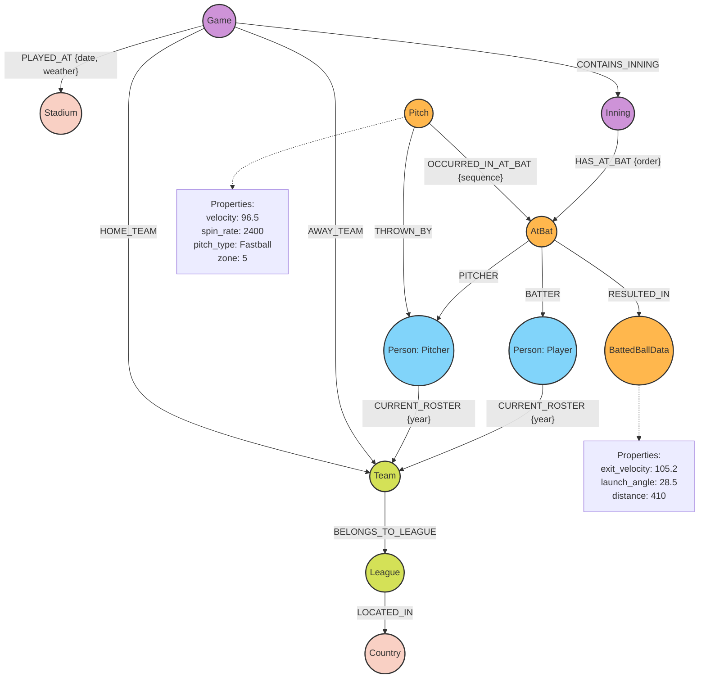

# INFORME MAESTRO TÉCNICO EJECUTIVO: Arquitectura de Base de Datos Inteligente para DIAMAX PRO

**Para:** Alí Zapata, CEO & Founder, 3Tree Digital Sport IA
**De:** Arquitecto Cloud, Base de Datos e IA Experto
**Fecha:** 15 de Septiembre de 2026
**Proyecto:** DIAMAX PRO - Sports Operating System PWA

---

## 1. RESUMEN EJECUTIVO

DIAMAX PRO se posiciona como el ecosistema definitivo para la gestión y análisis del béisbol y sóftbol a nivel global. Al operar de forma multi-tenant (múltiples ligas, países, y años simultáneamente) y manejar datos 100% estructurados (desde estadísticas sabermétricas hasta lanzamientos individuales), el sistema exige una arquitectura de datos que no solo almacene información, sino que la *entienda*.

Este informe delinea la estrategia para implementar una **Base de Datos Inteligente** basada en grafos, potenciada por **Redes Neuronales de Grafo (GNNs)** y operada de manera autónoma por **Agentes de Inteligencia Artificial (AI Agents)**. 

> [!IMPORTANT]
> El enfoque tradicional de bases de datos relacionales limitaría drásticamente la capacidad de DIAMAX PRO para encontrar patrones ocultos en el juego (ej. cómo el rendimiento de un bateador cambia frente a ciertos pitchers en condiciones específicas de clima y estadio). Una base de datos orientada a grafos es el núcleo habilitador para la IA avanzada que el mercado actual demanda.

**Conclusiones Clave de este Informe:**
1. **La Base de Datos:** Se recomienda **Neo4j** (AuraDB en Cloud) como motor principal por su superioridad en modelado de redes deportivas complejas y su integración nativa con Graph Data Science y LangChain.
2. **La Inteligencia (GNN):** Las Redes Neuronales de Grafo permitirán predecir el rendimiento (scouting predictivo), evaluar el riesgo de lesiones y optimizar las estrategias en el campo (shift positioning).
3. **El Agente IA:** Utilizaremos una arquitectura LangGraph para que un agente conversacional pueda interpretar preguntas complejas en lenguaje natural (ej. "Analiza las tendencias de pitcheo en cuentas de 2 strikes de los equipos de la liga invernal dominicana en 2025") y ejecutar consultas Cypher de forma autónoma.
4. **Infraestructura y Costos:** Desplegaremos en **AWS** (Amazon Web Services) con un presupuesto inicial (Fase 1 y 2) de entre **$600 y $1,200 mensuales**, altamente escalable gracias a arquitecturas serverless.
5. **Decisión "Build vs Buy":** Comprar servicios gestionados (SaaS/PaaS) para la infraestructura subyacente, pero **Construir (In-house)** la propiedad intelectual de los algoritmos GNN y la orquestación del Agente IA.

---

## 2. ARQUITECTURA PROPUESTA DEL SISTEMA

La arquitectura de DIAMAX PRO debe ser modular, escalable y orientada a eventos. El siguiente diagrama ilustra la interacción entre la PWA, los servicios backend, el sistema multi-tenant, la base de datos de grafos y el ecosistema de Inteligencia Artificial.


### Componentes Principales:
1. **Frontend (PWA):** Construida en React/Next.js, proporciona interfaces específicas por rol (Manager, Jugador, Scout, Fan).
2. **API Backend:** Capa de servicios que maneja la lógica de negocio y el enrutamiento Multi-Tenant.
3. **Data Layer (El Cerebro):** Base de datos de Grafos (Neo4j) como fuente primaria de la verdad para entidades y relaciones. Vector DB para búsquedas semánticas de historiales de texto o scouting reports. Data Lake para archivar el volumen masivo de cada pitcheo a largo plazo.
4. **AI Layer (La Inteligencia):** El Agente LangGraph recibe intenciones de usuario, extrae datos del grafo, corre inferencias en el motor GNN y devuelve reportes analíticos.

---

## 3. SELECCIÓN DE BASE DE DATOS PARA DIAMAX PRO

Para modelar un ecosistema de béisbol de múltiples ligas, evaluamos cinco tecnologías líderes.

### Comparativa Técnica y de Negocio

| Criterio | Neo4j (Recomendado) | Amazon Neptune | TigerGraph | PostgreSQL + pgvector | MongoDB Atlas |
| :--- | :--- | :--- | :--- | :--- | :--- |
| **Modelo de Datos** | Property Graph nativo | RDF / Property Graph | Property Graph masivo | Relacional + Vectores | Documental (JSON) |
| **Lenguaje Query** | Cypher (Estándar de facto, excelente para LLMs) | Gremlin / SPARQL / openCypher | GSQL (Curva de aprendizaje alta) | SQL | MQL (No ideal para grafos profundos) |
| **GNNs & Graph AI** | Neo4j Graph Data Science (GDS) integrado de fábrica | Soporte a Neptune ML (basado en DGL) pero rígido | Excelente para analítica paralela | Requiere exportación a Python | Difícil extraer grafos para PyTorch |
| **Ecosistema GenAI** | Integración nativa con LangChain, LlamaIndex | Moderada | Pobre/Cerrada | Excelente (pero relacional) | Excelente (Vector Search), pobre en relaciones |
| **Mantenimiento Multi-Tenant** | Soporte para múltiples bases en el mismo cluster (Fabric) | Bases aisladas = mayor costo base | Complejo de configurar | Esquemas (Schemas) nativos (Muy bueno) | Colecciones / Databases (Fácil) |
| **Costo Inicial (Startup)** | ~$350 - $800 / mes (AuraDB Pro) | ~$400 - $1000 / mes | Alto (Orientado a Enterprise puro) | ~$100 - $300 / mes | ~$100 - $300 / mes |

> [!TIP]
> **Recomendación: Neo4j AuraDB (GCP/AWS).**
> ¿Por qué? El Béisbol ES un grafo. Un Turno-al-Bate es un nodo que conecta al Lanzador, al Bateador, al Inning, al Estadio, al Receptor y al Árbitro. Neo4j permite consultas como: *"Encuentra todos los bateadores que han hecho home run ante una recta de más de 95mph en el 9no inning, en la Liga Venezolana, cuando la temperatura era < 20°C"*. En SQL esto requeriría más de 8 `JOINs` complejos, destrozando el rendimiento. Cypher lo hace en milisegundos con un simple *pattern matching*. Además, el soporte de Neo4j para IA y Agentes no tiene rival actualmente.

---

## 4. MODELO DE DATOS EN GRAFO (SCHEMA SABERMÉTRICO)

El modelo *Property Graph* nos permite almacenar propiedades tanto en los Nodos (Entidades) como en las Relaciones (Aristas o Edges).

### Nodos Principales (Labels)
- `Country`, `City`, `Stadium`
- `League`, `Season`, `Team`, `Roster`
- `Person` (Jugador, Manager, Scout, Umpire)
- `Game`, `Inning`, `HalfInning` (Top/Bottom)
- `AtBat` (Turno al Bate)
- `Pitch` (El lanzamiento individual, fundamental para Statcast y métricas avanzadas)
- `HitContext` (Spray chart, exit velocity, launch angle)

### Relaciones (Relationships)
- `(Team)-[:PLAYS_IN]->(League)`
- `(Person)-[:SIGNED_WITH {salary, startDate, endDate}]->(Team)`
- `(Game)-[:PLAYED_AT]->(Stadium)`
- `(Game)-[:HAS_INNING]->(Inning)`
- `(AtBat)-[:FACED_PITCHER]->(Person)`
- `(AtBat)-[:FACED_BATTER]->(Person)`
- `(Pitch)-[:PART_OF]->(AtBat)`

### Diagrama del Grafo de Béisbol (Mermaid)



> [!WARNING]
> En ligas de alto volumen, los nodos de `Pitch` (Lanzamientos) crecerán de manera exponencial (aprox. 300 pitches por juego). Es fundamental utilizar un diseño donde la base de datos operativa mantenga las temporadas actuales y recientes (Hot Data), mientras que las métricas de nivel de lanzamiento de años pasados (Cold Data) puedan archivarse en un Data Lake como AWS S3 o Snowflake, manteniendo en el grafo los *agregados sabermétricos* (ej. AVG de velocidad por pitcher por temporada).

---

## 5. CAPA DE IA: EL AGENTE AUTÓNOMO SABERMÉTRICO

El CEO solicita que un agente pueda "entrar a la BD, investigar, extraer y analizar". Para lograr esto sin alucinar y con total seguridad, utilizaremos una arquitectura de **Agente ReAct (Reasoning + Acting)** construida con LangGraph y herramientas (Tools) específicas.

### Arquitectura del Agente

1. **Orquestador (Supervisor Agent):** LLM (ej. GPT-4o o Claude 3.5 Sonnet) que recibe el prompt del usuario en lenguaje natural.
2. **Tools (Herramientas del Agente):**
   - `CypherQueryTool`: Traduce la pregunta a lenguaje Cypher, la ejecuta en Neo4j, y retorna los nodos/resultados estructurados.
   - `GNNInferenceTool`: Llama a modelos pre-entrenados para obtener predicciones (ej. "Predecir probabilidad de lesión de X jugador").
   - `StatcastMathTool`: Realiza cálculos estadísticos avanzados en Python (wOBA, FIP, WAR) sobre la marcha si el dato no está precalculado.
   - `DataVisualizationTool`: Genera código (ej. Plotly o Recharts) que el frontend puede renderizar visualmente.

### Flujo de Ejecución (Autónomo)

**Ejemplo de Prompt del Manager:** 
*"Quiero un reporte de cómo le va a Miguel Cabrera contra lanzadores zurdos que tiran slider a más de 85mph en la liga invernal, y dime cuál es nuestra mejor alineación contra el abridor de esta noche."*

**Proceso de LangGraph (Pensamiento del Agente):**
1. `Thought:` Necesito extraer las estadísticas de Cabrera contra LHP (zurdos) lanzando Sliders > 85mph.
2. `Action (CypherQueryTool):` 
   ```cypher
   MATCH (p:Person {name: 'Miguel Cabrera'})<-[:BATTER]-(ab:AtBat)<-[:OCCURRED_IN_AT_BAT]-(pt:Pitch)
   MATCH (ab)-[:PITCHER]->(pitcher:Person {throws: 'Left'})
   WHERE pt.pitch_type = 'Slider' AND pt.velocity > 85
   RETURN count(pt) as total_pitches, ab.result, avg(pt.exit_velocity)
   ```
3. `Observation:` Obtiene JSON con 45 turnos, .320 AVG, Exit Velocity promedio 98mph.
4. `Thought:` Ahora necesito evaluar al abridor de esta noche (Pedro Pérez) usando GNN para buscar similitudes con otros pitchers y sugerir el line-up.
5. `Action (GNNInferenceTool):` `predict_lineup_success(pitcher_id="12345", roster_id="789")`
6. `Observation:` El modelo devuelve el Line-Up ordenado del 1 al 9 maximizando el Expected wOBA.
7. `Final Output:` El Agente redacta el reporte ejecutivo y envía los datos al Frontend (PWA) para mostrar gráficos de zona de strike y el line-up recomendado.

> [!CAUTION]
> **Data Security para el Agente:** El agente no debe tener permisos de escritura (WRITE) directos en la base de datos de producción mediante comandos generados dinámicamente, para evitar inyecciones de *Prompt Injection* (Drop Database). Debe usar credenciales de Solo Lectura (READ ONLY) para las consultas Cypher generadas.

---

## 6. ARQUITECTURA DE REDES NEURONALES DE GRAFO (GNN) PARA BÉISBOL

Las métricas tradicionales (AVG, ERA) son unidimensionales. Las GNNs (Graph Neural Networks) pueden aprender los *embeddings* (vectores de características latentes) de jugadores analizando a **quién** se enfrentan y **cómo** interactúan en el grafo. 

Utilizaremos **PyTorch Geometric (PyG)** o **DGL (Deep Graph Library)**.

### Casos de Uso Core para DIAMAX PRO con GNNs:

1. **Scouting Predictivo y "Player Similarity" (Link Prediction / Node Classification)**
   - *Problema:* Encontrar talento oculto en ligas menores o colegiales (Moneyball moderno).
   - *Solución GNN:* Un modelo de *GraphSAGE* genera un embedding por jugador basado no solo en sus métricas, sino en la "fuerza de sus oponentes" (si bateó bien contra pitchers que a su vez dominan a bateadores élite). El sistema puede calcular Distancia Coseno para decir: "El perfil de red de este novato de 19 años en Dominicana es un 92% similar al de Juan Soto a esa edad".

2. **Optimización Táctica: Matchup Prediction (Edge Prediction)**
   - *Solución GNN:* Predecir el resultado de una arista inexistente `(Batter)-[:FACES]->(Pitcher)`. La red aprende las características del grafo heterogéneo (Clima, Inning, Tipos de Pitcheo) y estima la probabilidad (Expected Value) de un Home Run, Strikeout o Base on Balls ANTES de que el juego empiece.

3. **Prevención de Lesiones (Temporal Graph Networks)**
   - Analizando grafos que cambian en el tiempo (fatiga acumulada, variaciones milimétricas en el punto de soltar la bola - release point). Las redes espaciotemporales (STGNNs) pueden emitir alertas tempranas de riesgo de lesión de codo o ligamento colateral cubital (Tommy John).

### Flujo de Entrenamiento (MLOps)
El grafo en Neo4j se proyecta a memoria usando **Neo4j Graph Data Science (GDS)**. Se calculan features topológicos (PageRank del pitcher, Centralidad). Se exporta un subgrafo a Python/PyTorch para entrenar el modelo. El modelo genera *Embeddings*, los cuales se re-inyectan en Neo4j como propiedades del nodo para que el Agente IA pueda consultarlos en tiempo real.

---

## 7. CLOUD INFRASTRUCTURE Y OPTIMIZACIÓN DE COSTOS (STARTUP BUDGET)

Para un presupuesto startup de $500 - $2,000 mensuales, la arquitectura debe ser "Serverless First" o "Managed SaaS" para evitar costos fijos altos y escalar bajo demanda (pay-as-you-go).

**Proveedor Recomendado:** AWS (Amazon Web Services).

### Arquitectura de Despliegue (Fase Inicial)

| Componente | Servicio AWS / Solución | Costo Estimado (Mensual) |
| :--- | :--- | :--- |
| **Frontend PWA** | Vercel o AWS Amplify (CDN + Edge Functions) | $20 - $50 |
| **API / Backend Core** | AWS ECS Fargate (Contenedores Serverless) o AWS Lambda | $80 - $150 |
| **Database (Grafo)** | Neo4j AuraDB Professional (Totalmente Gestionado) | $350 - $800 |
| **LLM APIs (Agente IA)** | OpenAI API (GPT-4o) / Anthropic (Claude 3.5) / Bedrock | $50 - $200 (Por volumen de uso) |
| **GNN ML Engine** | AWS SageMaker Serverless Inference (Solo cobra al usar) | $50 - $150 |
| **Storage / Data Lake** | AWS S3 (Para backups y analíticas en frío) | $15 - $30 |
| **Multi-Tenant Auth** | AWS Cognito o Auth0 (Tier Startup) | $0 - $50 |
| **TOTAL ESTIMADO** | | **$565 - $1,430 mensuales** |

> [!TIP]
> **Optimización de Costos:** No mantengas máquinas virtuales (EC2) encendidas 24/7 para el entrenamiento GNN. Usa instancias *Spot* de AWS o Google Colab Pro para entrenar los modelos semanalmente y solo expón la inferencia vía endpoints serverless.

---

## 8. ARQUITECTURA MULTI-TENANT Y AISLAMIENTO DE DATOS

DIAMAX PRO albergará múltiples ligas (ej. Liga de Verano, Liga Invernal, Ligas Infantiles, Softbol) y equipos. El aislamiento estricto de datos (Data Isolation) es imperativo; un equipo no debe ver los reportes confidenciales de scouteo de otro.

### Estrategia recomendada: Row-Level/Node-Level Security con "TenantID" + Fabric

Dado que Neo4j AuraDB no crea "Bases de datos independientes por cliente" en su nivel de entrada sin incurrir en costos masivos (Database-per-Tenant), usaremos el patrón **"Pooled Data with Logical Isolation"**.

1. **Propiedad Tenant ID:** Cada nodo en el grafo (`Player`, `Game`, `AtBat`) lleva una propiedad indexada mandatoria `tenant_id` (o `league_id` / `organization_id`).
2. **Contexto de API Middleware:** Cuando el usuario se autentica en la PWA, obtiene un JWT que contiene su `tenant_id`. La API (Node/Go) intercepta las peticiones y modifica TODAS las consultas Cypher inyectando el `tenant_id`.
   - *Usuario intenta:* `MATCH (p:Player) RETURN p`
   - *API ejecuta:* `MATCH (p:Player) WHERE p.tenant_id = 'LIGA_VEN_25' RETURN p`
3. **Agente IA Seguro:** El Agente LangGraph recibe el `tenant_id` como un parámetro del sistema que no puede ser alterado por el usuario. El agente solo puede "ver" el subgrafo asociado a ese tenant.
4. **Datos Globales Compartidos (Cross-Tenant):** Jugadores profesionales (ej. Ronald Acuña Jr.) pueden jugar en la MLB, LVBP y el Clásico Mundial. Habrá Nodos Maestros Globales (Global Graph) de acceso de solo lectura, con relaciones específicas de rendimiento hacia nodos de ligas locales (`tenant_id`).

---

## 9. ROADMAP DE INVERSIÓN E IMPLEMENTACIÓN (3 FASES)

### Fase 1: MVP Estructural (Meses 1-3)
- **Objetivo:** PWA funcional, registro Multi-Tenant, Base de Datos de Grafos estructurada y carga de datos históricos básicos.
- **Entregables:**
  - Despliegue PWA Diamax Pro (Módulo de Equipos, Jugadores, Juegos).
  - Configuración de Neo4j AuraDB y esquema.
  - API de Ingesta (Parseo de archivos CSV/JSON de Statcast o anotadores manuales).
- **Costo de Inversión (Desarrollo):** $$ (Principalmente Full-stack + Data Engineer).

### Fase 2: Módulo Sabermétrico y Motor GNN (Meses 4-6)
- **Objetivo:** Pasar de datos crudos a inteligencia. Implementación de métricas sabermétricas avanzadas.
- **Entregables:**
  - Pipeline de ML (PyTorch Geometric).
  - Cálculo automático de wOBA, FIP, WAR a través de consultas analíticas.
  - Dashboards interactivos (Spray Charts, Heatmaps) en la PWA.
- **Costo de Inversión (Desarrollo):** $$$ (Requiere Data Scientist especializado en grafos).

### Fase 3: La IA Autónoma - "El Scout Virtual" (Meses 7-9)
- **Objetivo:** Despliegue del Agente de IA Conversacional.
- **Entregables:**
  - Integración LangGraph + Neo4j Vector Search (RAG hibrido).
  - Chatbot en la PWA donde gerentes puedan hablar con los datos ("Arma mi lineup").
  - Alertas automatizadas post-juego generadas por IA.
- **Costo de Inversión (Desarrollo):** $$ (AI/LLM Engineer).

---

## 10. RECOMENDACIÓN FINAL DEL ARQUITECTO: "BUILD VS BUY"

Sr. Alí Zapata, como CEO de 3Tree Digital Sport IA, mi recomendación ejecutiva es:

**COMPRAR (Buy - Infraestructura SaaS):**
NO intente crear y mantener clusters de bases de datos de grafos ni infraestructuras de Kubernetes in-house. **Compre Neo4j AuraDB** y servicios gestionados en AWS. El costo de mantenimiento y el talento DevOps requerido para mantener alta disponibilidad devorarán su presupuesto de startup. Use APIs de modelos de lenguaje (OpenAI/Anthropic) en lugar de intentar alojar Llama-3 localmente al principio.

**CONSTRUIR (Build - Propiedad Intelectual):**
Toda la lógica de negocio, el diseño del esquema del grafo, las herramientas del Agente (LangGraph Tools) y, lo más crítico, **los modelos GNN (Graph Neural Networks)**, deben construirse in-house (Inversión en talento). Esa es la Propiedad Intelectual (IP) que le dará a DIAMAX PRO su valoración astronómica en el mercado de SportsTech. Nadie más tendrá su grafo sabermétrico contextualizado.

**Tech Stack Definitivo Recomendado:**
- **UI:** React, Next.js, PWA, Tailwind.
- **Core API:** Node.js (TypeScript) o Go.
- **Database:** Neo4j (Graph) + AWS S3 (Cold Data).
- **AI/ML:** Python, PyTorch Geometric, LangChain / LangGraph, Neo4j Graph Data Science.

La era del béisbol guiado por tablas de Excel relacionales ha terminado. Con esta arquitectura de grafos e IA autónoma, DIAMAX PRO será capaz de ver el juego en 4D, revelando el "Matrix" del béisbol.

Fin del reporte. 
Quedo a su disposición para desglosar especificaciones técnicas a nivel de código de los motores GNN en nuestra próxima iteración.
