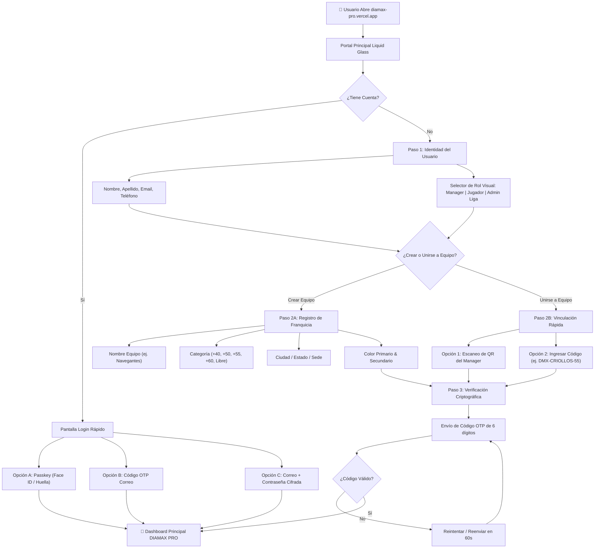

# 💎 DIAMAX PRO — INFORME MAESTRO DE LOS EXPERTOS
## Ecosistema de Registro, Autenticación Innovadora y Onboarding de Equipos

**Destinatario:** Ali Zapata — CEO & Fundador, 3Tree Digital Sport IA  
**Panel de Expertos:**  
- **Lead Cybersecurity & Zero Trust Architect** (Ciberseguridad y Encriptación)  
- **Staff Identity & IAM Engineer** (Arquitectura de Cuentas, Passkeys & Tokens)  
- **Principal Sport Tech UI/UX Designer** (Experiencia de Usuario Apple Liquid Glass)  
- **Database & Multi-Tenant Systems Architect** (Estructura de Equipos, Ligas y Rosters)  

**Objetivo:** Desarrollar la arquitectura de la pantalla principal, el flujo de bienvenida y el ecosistema de seguridad para el despliegue en [https://diamax-pro.vercel.app/](https://diamax-pro.vercel.app/).

---

## 1. EVALUACIÓN Y VALIDACIÓN DEL DIAGRAMA DEL FUNDADOR

El flujo propuesto por el Fundador es **sólido, lógico y responde con precisión a la realidad de las ligas deportivas**:
1. Puerta de decisión clara (*Iniciar Sesión* vs *Registrarse*).
2. Segmentación de perfil por datos clave y rol.
3. La bifurcación crítica del béisbol/softbol: **¿Creas tu equipo o te unes a uno existente?**
4. Verificación de identidad por correo (prevención de spam y cuentas fantasma).
5. Desembarque directo en el Dashboard operativo (Roster, Juegos, Sabermetría).

**El veredicto de los expertos:** Mantener el esqueleto conceptual del diagrama e inyectarle **innovación tecnológica sin fricción, automatización por códigos QR y blindaje de seguridad militar**.

---

## 2. PROPUESTA INNOVADORA DE REGISTRO Y ENTRADA (CERO FRICCIÓN)

En el terreno de juego (estadios, dugouts, campos de entrenamiento), los managers y jugadores no tienen tiempo para lidiar con contraseñas complejas ni formularios interminables. Los expertos proponen tres innovaciones clave:

### 🌟 Innovación 1: Passkeys & Biometría Nativa (WebAuthn / FIDO2)
* **Cómo funciona:** En lugar de obligar al usuario a inventar y memorizar contraseñas, el sistema le ofrece registrar su **Face ID, Touch ID o PIN del dispositivo** (iPhone, Android, Windows Hello, Mac).
* **Beneficio:** 
  - **Entrada en 1 segundo** con solo mirar el teléfono o tocar el sensor de huella.
  - **Inmunidad absoluta contra Phishing y robo de credenciales**: No existe contraseña en texto plano en la base de datos que un hacker pueda robar o adivinar.

### 🌟 Innovación 2: Acceso Rápido Passwordless por Código OTP / Magic Link
* Para usuarios que no tengan biometría o prefieran el método por correo:
  - Ingresan su correo y reciben un **código de 6 dígitos de alta visibilidad** (ej. `849-201`) o un enlace directo de 1 solo toque.
  - Al hacer clic, quedan autenticados de inmediato.

### 🌟 Innovación 3: Onboarding Viral de Equipos con "Team QR & Invite Code"
* **El dolor actual del Manager:** Tener que tipear manualmente a 20 o 25 jugadores con sus correos y cédulas/teléfonos.
* **La solución innovadora de DIAMAX PRO:**
  - Cuando el Manager crea el equipo (ej. *Criollos de San Diego +55*), DIAMAX genera automáticamente un **Código de Invitación Corto** (ej. `DMX-CRIOLLOS-55`) y un **Código QR Deportivo Dinámico**.
  - El Manager presiona el botón **"Compartir por WhatsApp al Grupo del Equipo"**.
  - Los jugadores simplemente tocan el enlace o escanean el QR: su perfil se auto-vincula al equipo y el Manager solo aprueba con un toque (*Aceptar en Roster*).

---

## 3. ARQUITECTURA DETALLADA DEL FLUJO PASO A PASO



---

## 4. DISEÑO DE LA PANTALLA PRINCIPAL (`https://diamax-pro.vercel.app/`)

### 🎨 Estética: Apple Liquid Glass Deportivo
- **Fondo:** Deep OLED Black (`#020617` / `#000000`) con sutil iluminación en gradiente azul diamante (`#0A84FF`) y ámbar sabermétrico (`#F26522`).
- **Contenedores:** Vidrio esmerilado translúcido (*frosted glassmorphism*) con bordes micro-iluminados (`border-white/10`) y desenfoque de fondo (*backdrop-blur-2xl*).
- **Tipografía:**
  - Títulos: *Syne* / *Inter Display* en peso 800/900 con tracking apretado.
  - Datos y códigos: *JetBrains Mono* / *SF Mono* de alta legibilidad.

### 📐 Secciones de la Portada de Bienvenida:
1. **Hero Header Dinámico:**
   - Logotipo oficial de **DIAMAX PRO** con destello de zafiro.
   - Tagline: *"Sports Operating System · Gestión Táctica, Rosters y Sabermetría de Élite"*.
2. **Selector de Entrada Dual:**
   - Dos pestañas superiores elegantes: **[ Iniciar Sesión ]** | **[ Crear Cuenta ]**.
3. **Selector de Rol con Tarjetas Táctiles 3D:**
   - 🧢 **Manager / Coach:** Acceso total a Roster, Lineup interactivo, control de turnos y métricas.
   - ⚾ **Jugador / Atleta:** Ver estadísticas individuales, avisos de juego y confirmación de asistencia (*Lineup Ready*).
   - 📋 **Comisionado / Liga:** Gestión de calendarios, tablas de posiciones y umpiring.
4. **Modo Offline Notifier:**
   - Una píldora sutil que indica: *"⚡ Sistema con Resiliencia Offline: Puedes ingresar y anotar en el estadio sin conexión a internet"*.

---

## 5. BLINDAJE DE SEGURIDAD ZERO TRUST (LAS 10 CAPAS APLICADAS)

| Capa | Implementación Específica en DIAMAX PRO |
| :--- | :--- |
| **Capa 1: Identidad** | Passkeys WebAuthn (FIDO2) como primer factor biométrico; OTP por correo de 6 dígitos con expiración a los 10 minutos. |
| **Capa 2: IAM & Roles** | RBAC estricto: Un Jugador **no puede** alterar el Lineup ni los registros de carreras; solo su Manager o el Anotador Oficial tienen permisos de escritura. |
| **Capa 3: Cifrado** | Datos de contacto y teléfonos de jugadores cifrados en base de datos; contraseñas con hashing moderno `Argon2id` (cero MD5 o SHA simple). |
| **Capa 4: API & Rate Limiting** | Máximo 5 intentos de autenticación cada 5 minutos por dirección IP para aniquilar ataques de fuerza bruta. |
| **Capa 5: Anti-Bot** | Verificación invisible contra bots automatizados sin fastidiar al usuario con CAPTCHAs complejos. |
| **Capa 6: Infraestructura** | Aislamiento multi-inquilino (*Multi-tenant*): Los datos de un equipo o liga son invisibles para ligas rivales. |
| **Capa 7: Auditoría** | Registro inmutable de cambios críticos (ej. quién modificó el score o la alineación oficial en el 7mo inning). |
| **Capa 8: Resiliencia PWA** | Almacenamiento local seguro en `IndexedDB` cifrado para operar en estadios sin señal telefónica, sincronizando con la nube en cuanto detecte Wi-Fi o 4G. |
| **Capa 9: Seguridad Cliente** | Cabeceras de protección en `vercel.json` (`X-Frame-Options: DENY`, `Strict-Transport-Security`, `CSP` estricto). |
| **Capa 10: Gobernanza** | Cumplimiento estricto en la privacidad de jugadores veteranos (+50, +55) y atletas juveniles según normativas de protección de datos. |

---

## 6. ESQUEMA DE DATOS RECOMENDADO PARA LA BASE DE DATOS

```typescript
// 1. Perfil de Usuario
interface UserProfile {
  id: string; // UUID v4
  fullName: string;
  email: string;
  phone?: string;
  role: 'MANAGER' | 'PLAYER' | 'COMMISSIONER' | 'SCORER';
  avatarUrl?: string;
  isEmailVerified: boolean;
  createdAt: string;
}

// 2. Franquicia / Equipo Deportivo
interface TeamProfile {
  id: string; // UUID v4
  name: string; // ej. "Cardenales Master"
  category: '+40' | '+50' | '+55' | '+60' | 'OPEN';
  city: string;
  state: string;
  colors: {
    primary: string; // Hex ej. "#F26522"
    secondary: string; // Hex ej. "#0A84FF"
  };
  inviteCode: string; // ej. "DMX-CARD-55"
  managerId: string; // FK a UserProfile.id
  logoUrl?: string;
}

// 3. Membresía de Roster
interface TeamMember {
  id: string;
  teamId: string;
  userId: string;
  jerseyNumber?: number;
  primaryPosition?: string; // "P", "C", "1B", "CF", etc.
  status: 'ACTIVE' | 'PENDING_APPROVAL' | 'INACTIVE';
}
```

---

## 7. PLAN DE IMPLEMENTACIÓN RECOMENDADO

1. **Fase 1: Maquetación de la Pantalla de Entrada (UI Apple Liquid Glass)**
   - Construir el modal/pantalla de Login y Registro sobre `index.html` en DIAMAX PRO con selector de rol y diseño translúcido.
2. **Fase 2: Motor de Registro & Creación de Equipos**
   - Implementar el formulario interactivo en 3 pasos (Identidad -> Franquicia/Unirse -> Código de verificación).
3. **Fase 3: Generador de QR y Enlaces Compartibles de WhatsApp**
   - Permitir al Manager enviar el enlace con 1 clic para llenar su roster automáticamente.
4. **Fase 4: Conexión con Backend Cifrado y Sincronización PWA Offline**
   - Asegurar persistencia local con IndexedDB + respaldo en Supabase/Firebase.

---

*Informe Certificado y Emitido por el Panel de Ingeniería y Arquitectura de 3Tree Digital Sport IA.*  
*Aprobado para revisión del Fundador y Dirección Ejecutiva.*
