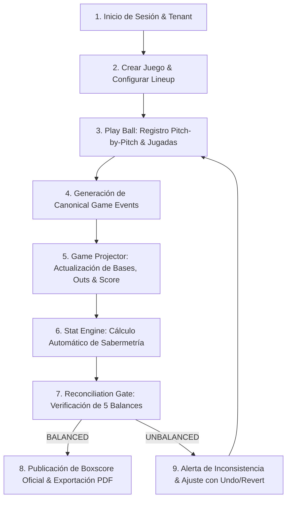

# 📘 MANUAL DE USO OFICIAL DE DIAMAX PRO
**Sports Operating System para Béisbol y Sóftbol**  
**3Tree Digital Sport IA · Lutz, Florida, USA**  
**Versión del Manual:** v1.0 — Oficial de Operación  
**Versión de la Aplicación:** v2.4.0-stable  
**Autoridad Ejecutiva:** Alí Zapata, Founder & CEO  

---

## 📑 TABLA DE CONTENIDOS
1. [Introducción & Propósito del Sistema](#1-introducción--propósito-del-sistema)
2. [Primer Acceso, Sesión & Navegación](#2-primer-acceso-sesión--navegación)
3. [🧢 Manual Paso a Paso del Anotador en Dugout](#3--manual-paso-a-paso-del-anotador-en-dugout)
4. [⚾ Manual de Operación para Managers](#4--manual-de-operación-para-managers)
5. [🧠 Manual Deportivo para Coaches & Analistas](#5--manual-deportivo-para-coaches--analistas)
6. [🏟️ Manual de Gestión para Administradores de Liga](#6-️-manual-de-gestión-para-administradores-de-liga)
7. [👤 Manual de Consulta para Jugadores & Padres](#7--manual-de-consulta-para-jugadores--padres)
8. [📊 Guía de Estadísticas & Sabermetría](#8--guía-de-estadísticas--sabermetría)
9. [🤖 Uso de DIAMAX Tactical AI](#9--uso-de-diamax-tactical-ai)
10. [🔐 Seguridad, Roles & Aislamiento Multi-Tenant](#10--seguridad-roles--aislamiento-multi-tenant)
11. [📡 Operación en Modo Offline & Sincronización](#11--operación-en-modo-offline--sincronización)
12. [↩️ Corrección de Jugadas (Undo & Revert)](#12-️-corrección-de-jugadas-undo--revert)
13. [🧾 Lectura, Reconciliación & Exportación de Boxscores](#13--lectura-reconciliación--exportación-de-boxscores)
14. [🚨 Guía de Resolución de Errores & Contingencias](#14--guía-de-resolución-de-errores--contingencias)
15. [🧪 Diagnóstico & Estado Operativo del Sistema](#15--diagnóstico--estado-operativo-del-sistema)
16. [🏆 Flujo Visual Completo de un Partido](#16--flujo-visual-completo-de-un-partido)
17. [📖 Glosario de Términos DIAMAX PRO](#17--glosario-de-términos-diamax-pro)
18. [✅ Checklists Rápidos por Rol](#18--checklists-rápidos-por-rol)

---

## 1. INTRODUCCIÓN & PROPÓSITO DEL SISTEMA

### 1.1. ¿Qué es DIAMAX PRO?
**DIAMAX PRO** es un Sistema Operativo Deportivo (*Sports Operating System*) de grado profesional diseñado como una Progressive Web App (PWA). Permite la anotación en tiempo real, el cálculo determinista de sabermetría avanzada, la toma de decisiones tácticas en el dugout y la gestión integral de ligas de béisbol y sóftbol.

### 1.2. Flujo Operativo General
El sistema opera bajo una cadena continua y unidireccional de valor deportivo:

$$	ext{Juego en Terreno} longrightarrow 	ext{Anotación Canónica} longrightarrow 	ext{Datos Estructurados} longrightarrow 	ext{Stat Engine} longrightarrow 	ext{Sabermetría} longrightarrow 	ext{Tactical AI} longrightarrow 	ext{Decisión}$$

### 1.3. Los Cuatro Pilares del Sistema
1. **Datos de Juego:** Registro físico exacto de pitcheos, jugadas, outs y corredores en bases.
2. **Estadísticas Derivadas:** Cálculo matemático puro (AVG, OBP, SLG, OPS, ERA, WHIP, FIP) sin intervención manual.
3. **Análisis Táctico (IA):** Interpretación contextual de tendencias, emparejamientos (*matchups*) y debilidades del rival basada en datos validados.
4. **Seguridad Multi-Tenant:** Aislamiento absoluto de datos entre diferentes organizaciones y ligas.

---

## 2. PRIMER ACCESO, SESIÓN & NAVEGACIÓN

### Procedimiento 2.1: Inicio de Sesión
- **Objetivo:** Acceder al espacio de trabajo de su organización/equipo con su rol asignado.
- **Requisitos:** Correo electrónico institucional y contraseña registrados previamente.
- **Paso 1:** Abra DIAMAX PRO en su navegador o instale la PWA desde la pantalla de inicio.
- **Paso 2:** En la pantalla de bienvenida (Página 1), presione **"Acceder al Sistema"**.
- **Paso 3:** Ingrese su correo electrónico y contraseña. Presione **"Entrar al Dugout"**.
- **Resultado Esperado:** El sistema valida su token JWT, extrae su `tenant_id` y rol (`MANAGER`, `COACH`, etc.) y lo posiciona en la pantalla principal (Página 3).
- **¿Qué hacer si falla?:** Verifique que no haya espacios en blanco en su correo. Si olvidó su clave, solicite un restablecimiento a su Administrador de Liga.

### Procedimiento 2.2: Selección de Equipo y Liga
- **Objetivo:** Establecer el contexto activo para anotar o consultar estadísticas.
- **Paso 1:** En la barra superior, observe el selector de organización / tenant.
- **Paso 2:** Seleccione la **Liga**, **Temporada** y **Equipo** con el que trabajará.
- **Resultado Esperado:** La interfaz carga el roster oficial, el calendario y los juegos en curso correspondientes a dicho equipo.

---

## 3. 🧢 MANUAL PASO A PASO DEL ANOTADOR EN DUGOUT

> [!TIP]
> **DISEÑO PARA EL DUGOUT:** La interfaz está optimizada con botones de alto contraste y tamaño táctil mínimo de $48 	imes 48	ext{ px}$ para permitir la anotación rápida con una sola mano bajo la presión del juego.

### 3.1. Configuración Previa al Partido
#### Procedimiento: Apertura de Juego y Lineup
- **Objetivo:** Preparar el encuentro antes de que se cante la voz de *"Play Ball"*.
- **Requisitos:** Conocer las alineaciones oficiales de ambos equipos (Visitante y Local).
- **Paso 1:** Presione el botón **"⚾ Nuevo Juego"**.
- **Paso 2:** Confirme el equipo Visitante (*Away*) y el equipo Local (*Home*).
- **Paso 3:** En el **Lineup Builder**, ordene los bateadores del 1 al 9 y asigne sus posiciones defensivas (P, C, 1B, 2B, 3B, SS, LF, CF, RF).
- **Paso 4:** Seleccione el Lanzador Abridor de cada equipo.
- **Paso 5:** Presione **"🔒 Iniciar Juego"**.
- **Resultado Esperado:** El marcador se inicializa en Inning 1 (Alta), 0 outs, conteo 0-0 y bases limpias.

---

### 3.2. Registro de Jugadas en Vivo (Acción por Acción)

#### A. Registro de Batazos (Hits)
1. **Sencillo (1B):**
   - *Acción:* Toque el botón verde **`1B`**.
   - *Comportamiento:* El bateador se ubica en 1ra base; los corredores precedentes avanzan según la física de la jugada.
2. **Doble (2B):**
   - *Acción:* Toque **`2B`**.
   - *Comportamiento:* Bateador a 2da base; corredores en 2da y 3ra anotan automáticamente.
3. **Triple (3B):**
   - *Acción:* Toque **`3B`**.
   - *Comportamiento:* Bateador a 3ra base; todos los corredores en base anotan carrera impulsada (RBI).
4. **Cuadrangular (HR):**
   - *Acción:* Toque **`HR`**.
   - *Comportamiento:* Se limpia el diamante; se acreditan tantas carreras como corredores había en base más el bateador; se suma 1 HR y los RBIs correspondientes.

#### B. Registro de Outs
1. **Ponche Tirándole (`K`):** Toque el botón **`K`**. Acredita ponche al lanzador y out al bateador.
2. **Ponche Cantado (`ꓘ`):** Toque **`ꓘ`** (Strikeout Looking).
3. **Rolata al Cuadro (`6-3`, `4-3`, `5-3`, `1-3`):** Toque el botón correspondiente a la combinación defensiva. Suma 1 Asistencia (A) al fildeador inicial, 1 Putout (PO) al inicialista y 1 Out al lanzador.
4. **Elevado a los Jardines (`F7`, `F8`, `F9`):** Toque el botón del jardinero que capturó la pelota.
5. **Doble Play (`DP`):** Toque **`DP`**. El sistema registra 2 outs simultáneos y ajusta los corredores en base.

#### C. Embases sin Bateo & Sacrificios
1. **Base por Bolas (`BB`):** Toque **`BB`**. Avanza al bateador a 1ra base de forma automática.
2. **Golpeado por Pitcheo (`HBP`):** Toque **`HBP`**. Bateador a 1ra base.
3. **Fly de Sacrificio (`SF`):** Toque **`SF`**. Se anota 1 Out, el corredor de 3ra anota carrera, se acredita 1 RBI y no cuenta como Turno Oficial al Bate (AB) para el promedio de bateo.
4. **Toque de Sacrificio (`SH`):** Toque **`SH`**. Registra el avance de corredores con 1 out sin afectar negativamente el promedio del bateador.

#### D. Jugadas de Corredores & Fallas Defensivas
1. **Robo de Base (`SB`):** Toque **`SB`** y confirme el corredor que avanzó.
2. **Atrapado Robando (`CS`):** Toque **`CS`**. Suma 1 Out al corredor y 1 Asistencia/Putout a la batería defensiva.
3. **Llegada por Error (`ROE`):** Toque **`ROE`** e indique la posición del error (1 al 9). El bateador se embasa, no se otorga Hit y la carrera potencial se clasifica como Sucia (*Unearned*).
4. **Wild Pitch (`WP`) / Passed Ball (`PB`):** Permite el avance de corredores sin alterar el turno al bate del bateador activo.

---

### 3.3. Cambios de Inning y Cierre de Partido
- **Cambio de Inning:** Al registrarse el 3er Out, el sistema realiza automáticamente la transición entre la Alta (`TOP`) y la Baja (`BOTTOM`) del inning, rotando el orden al bate y reseteando las bases y el conteo.
- **Finalización del Juego:** Al cumplirse el último out del 9no inning (o de extrainnings reglamentarios):
  1. Presione **"🏁 Finalizar Partido"**.
  2. El sistema ejecuta el **Reconciliation Gate**.
  3. Si la reconciliación es exitosa (**100% BALANCED**), el juego se sella como oficial y se habilita la exportación.

---

## 4. ⚾ MANUAL DE OPERACIÓN PARA MANAGERS

### 4.1. Gestión de Rosters y Equipos
- **Creación de Roster:** Ingrese a la pestaña **Roster**, añada a sus peloteros con su número de camiseta, posición principal, brazo de lanzar y perfil de bateo (Derecho, Zurdo, Ambidiestro).
- **Lineup Táctico:** Defina la alineación titular y la banca de suplentes antes de cada serie.

### 4.2. Análisis en Vivo desde la Cueva
- **Seguimiento del Conteo de Pitcheos:** Monitoree la fatiga del lanzador activo. El sistema alerta con colores cuando el abridor supera los 80, 95 y 105 lanzamientos.
- **Gráficos de Bateo (Spray Chart):** Consulte hacia dónde batea el rival con 2 strikes para ordenar ajustes en el posicionamiento defensivo de sus jardineros y cuadro interior.

---

## 5. 🧠 MANUAL DEPORTIVO PARA COACHES & ANALISTAS

### 5.1. Interpretación de Sabermetría Aplicada
- **RISP (*Runners in Scoring Position*):** Rendimiento de sus bateadores con hombres en 2da o 3ra base.
- **BABIP (*Batting Average on Balls In Play*):** Identifique si un jugador está teniendo mala suerte defensiva ($	ext{BABIP} < .250$) o si está bateando con alta efectividad de contacto ($	ext{BABIP} > .330$).
- **FIP (*Fielding Independent Pitching*):** Evalúe el verdadero talento de su lanzador aislando los factores que no dependen de la defensa (Ponches, Boletos y Jonrones).

### 5.2. Regla Fundamental de la IA Táctica
> [!IMPORTANT]
> **REGLA DE INTEGRIDAD:** DIAMAX Tactical AI **interpreta y contextualiza datos validados** por el Stat Engine. La IA **nunca tiene permiso para alterar números, inventar jugadas ni modificar estadísticas**.

---

## 6. 🏟️ MANUAL DE GESTIÓN PARA ADMINISTRADORES DE LIGA

### 6.1. Administración Multi-Tenant
Cada liga opera dentro de su propio **Tenant ID**. Un Administrador de la Liga de Tampa Bay no puede ver, modificar ni alterar los registros de la Liga de Caracas o Tokio.

### 6.2. Auditoría y Resolución de Incidencias
- **Revisión de Streams Canónicos:** Si un equipo protesta una jugada, el Administrador puede revisar el historial exacto de eventos segundo a segundo (`seq` 1, 2, 3...).
- **Cierre de Temporada:** Al finalizar el torneo regular, el Administrador genera el consolidado oficial de líderes de bateo y pitcheo con un solo clic.

---

## 7. 👤 MANUAL DE CONSULTA PARA JUGADORES & PADRES

### 7.1. Acceso a la Player Card
- **Perfil Deportivo:** Visualice su tarjeta oficial de pelotero con su fotografía, promedio de bateo (`AVG`), porcentaje de embasado (`OBP`), efectividad (`ERA`) y porcentaje de fildeo (`FLD%`).
- **Historial de Partidos:** Revise su desempeño turno por turno en cada encuentro disputado.
- **Exportación en PDF:** Descargue su ficha técnica oficial certificada por DIAMAX PRO para reclutamiento colegial o profesional.

---

## 8. 📊 GUÍA DE ESTADÍSTICAS & SABERMETRÍA

A continuación se detallan las fórmulas matemáticas oficiales implementadas en el motor de DIAMAX PRO:

### 8.1. Métricas de Bateo
- **Promedio de Bateo (AVG):**  
  $$	ext{AVG} = rac{	ext{Hits (H)}}{	ext{Turnos al Bate (AB)}}$$
- **Porcentaje de Embasado (OBP):**  
  $$	ext{OBP} = rac{H + BB + HBP}{AB + BB + HBP + SF}$$
- **Slugging (SLG):**  
  $$	ext{SLG} = rac{	ext{Bases Totales (TB)}}{AB} = rac{1B + (2 	imes 2B) + (3 	imes 3B) + (4 	imes HR)}{AB}$$
- **OPS (On-Base Plus Slugging):**  
  $$	ext{OPS} = 	ext{OBP} + 	ext{SLG}$$
- **Poder Aislado (ISO):**  
  $$	ext{ISO} = 	ext{SLG} - 	ext{AVG}$$
- **BABIP:**  
  $$	ext{BABIP} = rac{H - HR}{AB - K - HR + SF}$$

### 8.2. Métricas de Pitcheo
- **Innings Lanzados Visuales ($	ext{IP}_{	ext{visual}}$) vs. Outs Internos ($	ext{IP}_{	ext{outs}}$):**  
  Internamente siempre se contabilizan outs enteros ($	ext{IP}_{	ext{outs}} = 11$). Para visualización se expresa como `"3.2"` (3 innings completos y 2 outs).
- **Efectividad / Promedio de Carreras Limpias (ERA):**  
  $$	ext{ERA} = rac{	ext{Carreras Limpias (ER)} 	imes 27}{	ext{IP}_{	ext{outs}}}$$
- **WHIP (Walks + Hits per Inning Pitched):**  
  $$	ext{WHIP} = rac{(BB + H) 	imes 3}{	ext{IP}_{	ext{outs}}}$$
- **Relación Ponches / Boletos (K/BB):**  
  $$	ext{K/BB} = rac{	ext{Ponches (K)}}{	ext{Boletos (BB)}}$$

---

## 9. 🤖 USO DE DIAMAX TACTICAL AI

### 9.1. ¿Cómo interactuar con el Agente Táctico?
En la pestaña **"Tactical AI"**, el Manager o Coach puede realizar consultas en lenguaje natural:
- *"¿Cuál es la zona más vulnerable del bateador #4 contra lanzamientos rompientes?"*
- *"Recomienda un cambio de lanzador para enfrentar a los siguientes 3 bateadores zurdos."*
- *"¿Cuál es la probabilidad de éxito de un robo de base con el corredor actual en 1ra base?"*

### 9.2. Límites Operativos
La IA responderá basándose estrictamente en el historial estructurado de eventos del juego. Si no existen suficientes datos históricos de un jugador, la IA indicará: *"Muestra insuficiente de datos para inferencia táctica"* en lugar de suponer información.

---

## 10. 🔐 SEGURIDAD, ROLES & AISLAMIENTO MULTI-TENANT

### 10.1. Matriz de Permisos por Rol (RBAC)
| Rol | Ver Juegos | Anotar Jugadas (`event:append`) | Gestionar Roster | Modificar Liga | Administrar Usuarios |
| :--- | :---: | :---: | :---: | :---: | :---: |
| **CEO / Superadmin** | ✅ | ✅ | ✅ | ✅ | ✅ |
| **ADMIN_LIGA** | ✅ | ✅ | ✅ | ✅ | ✅ |
| **MANAGER** | ✅ | ✅ | ✅ | ❌ | ❌ |
| **COACH** | ✅ | ✅ | ❌ | ❌ | ❌ |
| **SCORER (Anotador)** | ✅ | ✅ | ❌ | ❌ | ❌ |
| **PLAYER / PADRE** | ✅ | ❌ | ❌ | ❌ | ❌ |

---

## 11. 📡 OPERACIÓN EN MODO OFFLINE & SINCRONIZACIÓN

### 11.1. ¿Qué ocurre si se cae el Wi-Fi en el estadio?
DIAMAX PRO está construido con arquitectura **Offline-First**:
1. **Continuidad Total:** La aplicación sigue funcionando sin interrupciones. Cada jugada se guarda instantáneamente en la base de datos local del navegador (**IndexedDB**).
2. **Estado `PENDING`:** Los eventos generados sin conexión se marcan con estado `PENDING`.
3. **Reconexión Automática:** En cuanto el dispositivo recupera señal celular o Wi-Fi, el **Sync Engine** envía la cola pendiente a **Supabase Cloud**.
4. **Estado `CANONICAL`:** El servidor central valida la secuencia y asigna el número oficial `seq` de forma monótona e inmutable.

---

## 12. ↩️ CORRECCIÓN DE JUGADAS (UNDO & REVERT)

> [!CAUTION]
> **NUNCA EDITE ESTADÍSTICAS MANUALMENTE:** Si hubo una equivocación, corrija el evento generador usando la función oficial de reversión.

### 12.1. Diferencia entre Local Undo y Canonical Revert
1. **Local Undo (Evento PENDING):**
   - *Escenario:* Se anotó una bola mala en lugar de un strike hace 2 segundos y aún no se ha sincronizado con la nube.
   - *Acción:* Presione **"↩️ Deshacer"**. El evento se descarta de la cola local y se recalcula el estado inmediatamente.
2. **Canonical Revert (Evento ya en la Nube):**
   - *Escenario:* Un hit ya fue confirmado por el servidor en la nube.
   - *Acción:* Presione **"↩️ Deshacer"**. El sistema emite un evento canónico compensatorio de tipo **`EVENT_REVERT`**. El historial no se borra; se añade la compensación matemática y se re-proyecta el juego de forma 100% limpia.

---

## 13. 🧾 LECTURA, RECONCILIACIÓN & EXPORTACIÓN DE BOXSCORES

### 13.1. Reconciliación de los 5 Balances
Antes de sellar cualquier reporte oficial, DIAMAX PRO verifica 5 balances contables obligatorios:
1. **Balance de Carreras ($R$):** $sum 	ext{Carreras en Eventos} = 	ext{Total Boxscore} = 	ext{Marcador}$.
2. **Balance de Hits ($H$):** $sum 	ext{Hits en Eventos} = 	ext{Total Boxscore} = 	ext{Total de Equipo}$.
3. **Balance de Impulsadas ($RBI$):** $sum 	ext{RBIs en Eventos} = 	ext{Total Boxscore}$.
4. **Balance de Outs:** $sum 	ext{Outs Registrados} = 	ext{Outs Lanzados por Pitchers}$.
5. **Balance de Errores ($E$):** $sum 	ext{Errores en Eventos} = 	ext{Total Fildeo de Equipo}$.

### 13.2. Exportación
Al cumplirse la reconciliación (**Reporte Válido**):
- Presione **"📄 Exportar Boxscore PDF"** para generar la planilla oficial de anotación.
- Presione **"📋 Copiar Resumen de Prensa"** para compartir el resultado en redes sociales o WhatsApp.

---

## 14. 🚨 GUÍA DE RESOLUCIÓN DE ERRORES & CONTINGENCIAS

| Situación / Incidencia | Causa Probable | Acción Correctiva Recomendada |
| :--- | :--- | :--- |
| **Sin Conexión a Internet** | Falla de señal en el estadio | Continúe anotando normalmente en modo Offline. El sistema sincronizará al regresar la red. |
| **Evento Rechazado** | Inconsistencia física (ej. out con 3 outs previos) | Verifique el estado de las bases y conteo actual antes de repetir la jugada. |
| **Error de Sincronización** | Interrupción temporal de red en pleno envío | No fuerce recargas; el Sync Engine reintentará automáticamente con retroceso exponencial (*backoff*). |
| **Reconciliación Fallida** | Discrepancia matemática en carreras u outs | Utilice `↩️ Deshacer` hasta la jugada conflictiva y asigne el resultado correcto. No publique el juego hasta obtener `BALANCED`. |
| **Sesión Expirada** | Tiempo de token cumplido (24 horas) | Inicie sesión nuevamente. Sus datos locales no sincronizados permanecerán seguros en IndexedDB. |

---

## 15. 🧪 DIAGNÓSTICO & ESTADO OPERATIVO DEL SISTEMA

Los usuarios con rol de **Administrador** o **Manager** pueden verificar la salud del sistema en tiempo real en la sección **"System Status"**:
- **Application:** 🟢 ONLINE
- **Event Store:** 🟢 ONLINE
- **Game Projector:** 🟢 ONLINE
- **Stat Engine:** 🟢 ONLINE
- **Reconciliation Gate:** 🟢 BALANCED

---

## 16. 🏆 FLUJO VISUAL COMPLETO DE UN PARTIDO

---

## 17. 📖 GLOSARIO DE TÉRMINOS DIAMAX PRO

- **Canonical Event (Evento Canónico):** Registro atómico, inmutable e indivisible de una acción ocurrida en el juego.
- **Event Store:** Libro contable central donde se almacenan todos los eventos en orden cronológico estricto.
- **Game Projector:** Motor que lee los eventos desde el inicio y reconstruye el estado actual del juego (*GameState*).
- **Stat Engine:** Motor determinista que calcula todas las estadísticas y realiza el *Run Accounting* (carreras limpias vs. sucias).
- **Reconciliation Gate:** Compuerta de auditoría matemática que garantiza que no existan discrepancias numéricas.
- **Tenant ID:** Identificador único de aislamiento que separa los datos de cada organización o liga.
- **Spray Chart:** Mapa 2D de dispersión de batazos en el terreno de juego.

---

## 18. ✅ CHECKLISTS RÁPIDOS POR ROL

### 🧢 Checklist para el Anotador en Dugout
- [ ] Juego creado con equipos Local y Visitante correctos.
- [ ] Lineup de 9 bateadores y posiciones defensivas confirmado.
- [ ] Lanzadores abridores seleccionados.
- [ ] Registro lanzamiento a lanzamiento o jugada por jugada activo.
- [ ] Sustituciones de lanzadores o bateadores registradas en su momento exacto.
- [ ] Partido finalizado tras el último out reglamentario.
- [ ] **Reconciliation Gate con estatus 100% BALANCED verificado.**

### ⚾ Checklist para el Manager
- [ ] Roster oficial del equipo actualizado en la plataforma.
- [ ] Alineación ofensiva establecida antes del partido.
- [ ] Monitoreo de conteo de pitcheo y fatiga en vivo.
- [ ] Consulta de Spray Charts rivales durante el encuentro.
- [ ] Revisión del Boxscore y Player Cards al concluir la jornada.

### 🏟️ Checklist para el Administrador de Liga
- [ ] Ligas, categorías y temporadas configuradas en el Tenant.
- [ ] Roles y permisos asignados a Managers y Anotadores.
- [ ] Supervisión del calendario y estado de los juegos en vivo.
- [ ] Auditoría y validación de tablas de posiciones y líderes individuales.

---
**DIAMAX PRO — Sports Operating System**  
*3Tree Digital Sport IA · Excelencia Tecnológica e Integridad Matemática en el Béisbol.*
