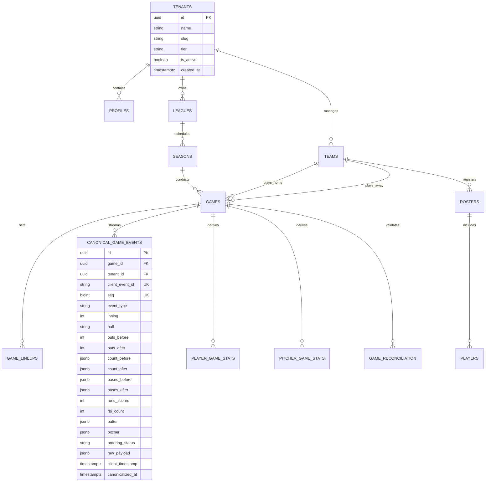
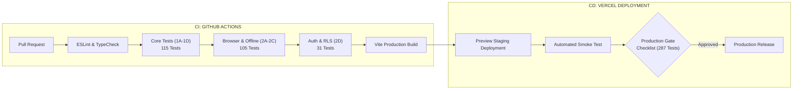

# 🏗️ DIAMAX PRO — PRODUCTION ARCHITECTURE, DATABASE & CLOUD DEPLOYMENT BLUEPRINT v1.0
**3Tree Digital Sport IA · Lutz, Florida, USA**  
**Autoridad Ejecutiva:** Alí Zapata, Founder & CEO  
**Fecha de Publicación:** Septiembre 2026  
**Estado:** CONTRATO DE INFRAESTRUCTURA DE PRODUCCIÓN (FROZEN v1.0)

---

## 📑 TABLA DE CONTENIDOS
1. [Resumen Ejecutivo y Declaración de Verdad Canónica](#1-resumen-ejecutivo-y-declaración-de-verdad-canónica)
2. [Arquitectura del Sistema (Event Sourcing + CQRS + Cloud Replica)](#2-arquitectura-del-sistema)
3. [Diagrama Entidad-Relación (ERD) & Modelo Relacional](#3-diagrama-entidad-relación-erd--modelo-relacional)
4. [Especificación Exhaustiva de Tablas, Tipos, Índices y Restricciones](#4-especificación-exhaustiva-de-tablas-tipos-índices-y-restricciones)
5. [Inmutabilidad del Stream de Eventos & RPC Atómica de Sincronización](#5-inmutabilidad-del-stream-de-eventos--rpc-atómica-de-sincronización)
6. [Políticas de Seguridad Row Level Security (RLS) & Aislamiento Multi-Tenant](#6-políticas-de-seguridad-row-level-security-rls--aislamiento-multi-tenant)
7. [Autenticación Supabase Auth & Matriz RBAC](#7-autenticación-supabase-auth--matriz-rbac)
8. [Estrategia de Proyecciones Estadísticas Derivadas](#8-estrategia-de-proyecciones-estadísticas-derivadas)
9. [Gestión Segura de Secretos y Variables de Entorno (.env)](#9-gestión-segura-de-secretos-y-variables-de-entorno-env)
10. [Pipeline de Integración y Despliegue Continuo (CI/CD)](#10-pipeline-de-integración-y-despliegue-continuo-cicd)
11. [Estrategia de Backup, Recuperación ante Desastres (DRP) y Rollback](#11-estrategia-de-backup-recuperación-ante-desastres-drp-y-rollback)
12. [Matriz de Pruebas & Production Gate Checklist](#12-matriz-de-pruebas--production-gate-checklist)

---

## 1. RESUMEN EJECUTIVO Y DECLARACIÓN DE VERDAD CANÓNICA

> [!IMPORTANT]
> **REGLA FUNDAMENTAL DE DIAMAX PRO:**  
> **UNA JUGADA $longrightarrow$ UN EVENTO CANÓNICO $longrightarrow$ TODOS LOS DATOS Y ESTADÍSTICAS SE DERIVAN EXCLUSIVAMENTE DE ÉL.**  
> Ninguna interfaz gráfica (UI), botón, servicio backend o agente de IA tiene autorización para modificar directamente promedios de bateo (`AVG`), carreras (`R`), efectividad (`ERA`) o el marcador (`boxscore`).

El propósito de este Blueprint es gobernar la construcción e implementación de la infraestructura en la nube de **DIAMAX PRO** sobre **Supabase (PostgreSQL 16+)**, **Vercel** e **IndexedDB/Dexie.js**, garantizando:
- **0% Divergencia de Datos:** Una sola verdad matemática determinista.
- **Aislamiento Multi-Tenant Estricto:** Separación física/lógica por `tenant_id` mediante Row Level Security (RLS) en el motor de base de datos.
- **Resiliencia Dugout Offline:** Anotación ininterrumpida sin conexión con cola de sincronización idempotente ($sync(sync(E)) \equiv sync(E)$).
- **Protección contra Falsificación (Anti-Tampering):** Inmutabilidad del stream de eventos y barrera de reconciliación matemática (*Reconciliation Gate*).

---

## 2. ARQUITECTURA DEL SISTEMA

```mermaid
flowchart TD
    subgraph CLIENT[" CLIENTE: PWA / BROWSER / DUGOUT "]
        UI["Dugout UI Buttons"] -->|Dispatch Intent| DISPATCHER["DIAMAX Command Dispatcher"]
        DISPATCHER -->|Validate & Append| LOCAL_IDB[("IndexedDB / Dexie\nLocal Replica")]
        DISPATCHER -->|Enqueue| OFF_Q[("offline_queue\n(FIFO + Backoff)")]
    end

    subgraph SYNC_LAYER[" CAPA DE SINCRONIZACIÓN IDEMPOTENTE "]
        OFF_Q -->|syncBatch() RPC| RPC["fn_sync_canonical_event()"]
    end

    subgraph CLOUD[" SUPABASE CLOUD (SOURCE OF RECORD) "]
        AUTH["Supabase Auth\nJWT + Claims (tenant_id, role)"] -.->|Authorize| RLS["Row Level Security (RLS)"]
        RPC -->|Atomic Lock & Assign Seq| EVT_TABLE[("canonical_game_events\n(Strictly Immutable)")]
        RLS --- EVT_TABLE
        EVT_TABLE -->|Trigger Projections| MAT_STATS[("Derived Stats & Boxscore\n(Cached Views)")]
    end

    subgraph ENGINES[" PROCESAMIENTO DETERMINISTA "]
        EVT_TABLE -->|Stream| GP["Game Projector\n(State Reconstruction)"]
        GP --> SE["Stat Engine\n(Run Accounting & Sabermetrics)"]
        SE --> RG{"Reconciliation Gate\n(5 Balances & Invariants)"}
        RG -->|PASS| PUB["Public Dashboards / PDF Export / AI Context"]
        RG -->|FAIL| ALERT["Tamper Alert & Publication Block"]
    end
```

---

## 3. DIAGRAMA ENTIDAD-RELACIÓN (ERD) & MODELO RELACIONAL



---

## 4. ESPECIFICACIÓN EXHAUSTIVA DE TABLAS, TIPOS, ÍNDICES Y RESTRICCIONES

### 4.1. Tipos Enumerados del Dominio
```sql
CREATE TYPE user_role AS ENUM ('CEO', 'ADMIN', 'MANAGER', 'COACH', 'SCORER', 'PLAYER');
CREATE TYPE game_status AS ENUM ('SCHEDULED', 'WARMUP', 'IN_PROGRESS', 'FINAL', 'SUSPENDED', 'CANCELLED');
CREATE TYPE half_inning_enum AS ENUM ('TOP', 'BOTTOM');
CREATE TYPE ordering_status_enum AS ENUM ('PENDING', 'CANONICAL', 'REVERTED');
```

### 4.2. Tablas Principales

#### 1. `tenants`
| Columna | Tipo | Restricciones | Descripción |
| :--- | :--- | :--- | :--- |
| `id` | `UUID` | `PRIMARY KEY DEFAULT gen_random_uuid()` | Identificador único del tenant |
| `name` | `VARCHAR(255)` | `NOT NULL` | Nombre de la organización/liga matriz |
| `slug` | `VARCHAR(100)` | `UNIQUE NOT NULL` | Identificador amigable en URL |
| `status` | `VARCHAR(50)` | `DEFAULT 'ACTIVE' NOT NULL` | Estado de suscripción |
| `created_at` | `TIMESTAMPTZ` | `DEFAULT NOW() NOT NULL` | Fecha de registro |

#### 2. `profiles` (Extiende `auth.users`)
| Columna | Tipo | Restricciones | Descripción |
| :--- | :--- | :--- | :--- |
| `id` | `UUID` | `PRIMARY KEY REFERENCES auth.users(id) ON DELETE CASCADE` | ID de usuario en Supabase Auth |
| `tenant_id` | `UUID` | `NOT NULL REFERENCES tenants(id) ON DELETE CASCADE` | Tenant al que pertenece |
| `email` | `VARCHAR(255)` | `UNIQUE NOT NULL` | Correo electrónico institucional |
| `full_name` | `VARCHAR(255)` | `NOT NULL` | Nombre y apellido |
| `role` | `user_role` | `DEFAULT 'PLAYER' NOT NULL` | Rol y privilegios RBAC |
| `phone` | `VARCHAR(50)` | `NULL` | Teléfono de contacto |
| `created_at` | `TIMESTAMPTZ` | `DEFAULT NOW() NOT NULL` | Fecha de creación |

#### 3. `canonical_game_events` (CORAZÓN DEL SISTEMA)
| Columna | Tipo | Restricciones | Descripción |
| :--- | :--- | :--- | :--- |
| `id` | `UUID` | `PRIMARY KEY DEFAULT gen_random_uuid()` | Identificador único del evento en la nube |
| `game_id` | `UUID` | `NOT NULL REFERENCES games(id) ON DELETE CASCADE` | Juego al que pertenece el evento |
| `tenant_id` | `UUID` | `NOT NULL REFERENCES tenants(id) ON DELETE CASCADE` | Aislamiento multi-tenant |
| `client_event_id` | `VARCHAR(100)` | `NOT NULL` | UUID generado en cliente para idempotencia |
| `seq` | `BIGINT` | `NOT NULL` | Número entero monótono asignado por el servidor |
| `event_type` | `VARCHAR(50)` | `NOT NULL` | Tipo de jugada (`PLAY_HIT`, `PLAY_OUT`, etc.) |
| `schema_version` | `VARCHAR(20)` | `DEFAULT '1.1-FINAL' NOT NULL` | Versión del contrato |
| `inning` | `INT` | `NOT NULL CHECK (inning >= 1)` | Inning actual |
| `half` | `half_inning_enum` | `NOT NULL` | `TOP` o `BOTTOM` |
| `outs_before` | `INT` | `NOT NULL CHECK (outs_before BETWEEN 0 AND 2)` | Outs antes del evento |
| `outs_after` | `INT` | `NOT NULL CHECK (outs_after BETWEEN 0 AND 3)` | Outs después del evento |
| `count_before` | `JSONB` | `NOT NULL` | `{ balls: 0..3, strikes: 0..2 }` |
| `count_after` | `JSONB` | `NOT NULL` | `{ balls: 0..3, strikes: 0..2 }` |
| `bases_before` | `JSONB` | `NOT NULL` | Corredores en bases antes de la jugada |
| `bases_after` | `JSONB` | `NOT NULL` | Corredores en bases tras la jugada |
| `runs_scored` | `INT` | `DEFAULT 0 NOT NULL` | Carreras producidas en la jugada |
| `rbi_count` | `INT` | `DEFAULT 0 NOT NULL` | Carreras impulsadas (RBI) |
| `batter` | `JSONB` | `NOT NULL` | Datos del bateador en turno |
| `pitcher` | `JSONB` | `NOT NULL` | Datos del lanzador actuante |
| `reverted_event_id` | `VARCHAR(100)` | `NULL` | ID de evento compensado si es `EVENT_REVERT` |
| `ordering_status` | `ordering_status_enum` | `DEFAULT 'CANONICAL' NOT NULL` | Estado de ordenamiento |
| `raw_payload` | `JSONB` | `NOT NULL` | Payload íntegro original |
| `client_timestamp` | `TIMESTAMPTZ` | `NOT NULL` | Marca de tiempo del cliente |
| `canonicalized_at` | `TIMESTAMPTZ` | `DEFAULT NOW() NOT NULL` | Marca de tiempo en el servidor |

**Restricciones de Unicidad:**
```sql
ALTER TABLE public.canonical_game_events 
    ADD CONSTRAINT uq_game_client_event UNIQUE (game_id, client_event_id);

ALTER TABLE public.canonical_game_events 
    ADD CONSTRAINT uq_game_seq UNIQUE (game_id, seq);
```

---

## 5. INMUTABILIDAD DEL STREAM DE EVENTOS & RPC ATÓMICA

### 5.1. Disparador de Inmutabilidad Absoluta
```sql
CREATE OR REPLACE FUNCTION public.prevent_event_stream_tampering()
RETURNS TRIGGER AS $$
BEGIN
    RAISE EXCEPTION 'DIAMAX SECURITY VIOLATION: El stream de eventos canónicos es estrictamente inmutable. Las operaciones UPDATE y DELETE están prohibidas.';
END;
$$ LANGUAGE plpgsql;

CREATE TRIGGER trg_immutable_canonical_events
    BEFORE UPDATE OR DELETE ON public.canonical_game_events
    FOR EACH ROW
    EXECUTE FUNCTION public.prevent_event_stream_tampering();
```

### 5.2. RPC de Sincronización Canónica (`fn_sync_canonical_event`)
```sql
CREATE OR REPLACE FUNCTION public.fn_sync_canonical_event(
    p_event JSONB,
    p_tenant_id UUID
)
RETURNS JSONB
LANGUAGE plpgsql
SECURITY DEFINER
AS $$
DECLARE
    v_game_id UUID := (p_event->>'gameId')::UUID;
    v_client_event_id VARCHAR(100) := p_event->>'clientEventId';
    v_existing RECORD;
    v_next_seq BIGINT;
    v_inserted_id UUID;
BEGIN
    IF v_game_id IS NULL OR v_client_event_id IS NULL THEN
        RAISE EXCEPTION 'Payload inválido: gameId y clientEventId son requeridos.';
    END IF;

    -- 1. Verificación de Idempotencia
    SELECT id, seq, client_event_id, ordering_status INTO v_existing
    FROM public.canonical_game_events
    WHERE game_id = v_game_id AND client_event_id = v_client_event_id;

    IF FOUND THEN
        RETURN jsonb_build_object(
            'status', 'ALREADY_EXISTS',
            'clientEventId', v_existing.client_event_id,
            'seq', v_existing.seq,
            'orderingStatus', v_existing.ordering_status,
            'id', v_existing.id
        );
    END IF;

    -- 2. Bloqueo Transaccional a Nivel de Partido
    PERFORM pg_advisory_xact_lock(hashtext(v_game_id::text));

    -- 3. Asignación de Secuencia Monótona
    SELECT COALESCE(MAX(seq), 0) + 1 INTO v_next_seq
    FROM public.canonical_game_events
    WHERE game_id = v_game_id;

    -- 4. Inserción Canónica
    INSERT INTO public.canonical_game_events (
        game_id, client_event_id, seq, event_type, schema_version,
        inning, half, outs_before, outs_after, count_before, count_after,
        bases_before, bases_after, runs_scored, rbi_count,
        batter, pitcher, reverted_event_id, ordering_status,
        raw_payload, client_timestamp, canonicalized_at, tenant_id
    ) VALUES (
        v_game_id, v_client_event_id, v_next_seq, p_event->>'type',
        COALESCE(p_event->>'schemaVersion', '1.1-FINAL'),
        (p_event->>'inning')::INT, (p_event->>'half')::half_inning_enum,
        (p_event->>'outsBefore')::INT, (p_event->>'outsAfter')::INT,
        COALESCE(p_event->'countBefore', '{"balls":0,"strikes":0}'::JSONB),
        COALESCE(p_event->'countAfter', '{"balls":0,"strikes":0}'::JSONB),
        COALESCE(p_event->'basesBefore', '{}'::JSONB),
        COALESCE(p_event->'basesAfter', '{}'::JSONB),
        COALESCE((p_event->>'runsScored')::INT, 0),
        COALESCE((p_event->>'rbiCount')::INT, 0),
        COALESCE(p_event->'batter', '{}'::JSONB),
        COALESCE(p_event->'pitcher', '{}'::JSONB),
        p_event->>'revertedEventId',
        'CANONICAL',
        p_event,
        COALESCE((p_event->>'timestamp')::TIMESTAMPTZ, NOW()),
        NOW(),
        p_tenant_id
    ) RETURNING id INTO v_inserted_id;

    -- 5. Registro de Auditoría
    INSERT INTO public.sync_audit_log (game_id, client_event_id, assigned_seq, sync_status, tenant_id)
    VALUES (v_game_id, v_client_event_id, v_next_seq, 'SYNCED', p_tenant_id);

    RETURN jsonb_build_object(
        'status', 'SYNCED',
        'clientEventId', v_client_event_id,
        'seq', v_next_seq,
        'orderingStatus', 'CANONICAL',
        'id', v_inserted_id
    );
END;
$$;
```

---

## 6. POLÍTICAS DE SEGURIDAD ROW LEVEL SECURITY (RLS)

```sql
-- Funciones Auxiliares de Contexto
CREATE OR REPLACE FUNCTION get_auth_tenant_id() RETURNS UUID AS $$
    SELECT tenant_id FROM public.profiles WHERE id = auth.uid() LIMIT 1;
$$ LANGUAGE sql SECURITY DEFINER STABLE;

CREATE OR REPLACE FUNCTION get_auth_role() RETURNS user_role AS $$
    SELECT role FROM public.profiles WHERE id = auth.uid() LIMIT 1;
$$ LANGUAGE sql SECURITY DEFINER STABLE;

CREATE OR REPLACE FUNCTION is_ceo() RETURNS BOOLEAN AS $$
    SELECT get_auth_role() = 'CEO';
$$ LANGUAGE sql SECURITY DEFINER STABLE;

-- 1. CANONICAL GAME EVENTS RLS
CREATE POLICY "Events: Ver eventos del tenant" ON public.canonical_game_events
    FOR SELECT USING (is_ceo() OR tenant_id = get_auth_tenant_id());

CREATE POLICY "Events: Anotadores insertan eventos" ON public.canonical_game_events
    FOR INSERT WITH CHECK (
        is_ceo() OR (
            get_auth_role() IN ('ADMIN', 'MANAGER', 'COACH', 'SCORER') 
            AND tenant_id = get_auth_tenant_id()
        )
    );

-- 2. GAMES RLS
CREATE POLICY "Games: Ver juegos del tenant" ON public.games
    FOR SELECT USING (is_ceo() OR tenant_id = get_auth_tenant_id());

CREATE POLICY "Games: Staff gestiona juegos" ON public.games
    FOR ALL USING (
        is_ceo() OR (
            get_auth_role() IN ('ADMIN', 'MANAGER', 'COACH') 
            AND tenant_id = get_auth_tenant_id()
        )
    );
```

---

## 7. AUTENTICACIÓN SUPABASE AUTH & MATRIZ RBAC

### Matriz de Privilegios
| Capacidad / Permiso | CEO | ADMIN | MANAGER | COACH | SCORER | PLAYER |
| :--- | :---: | :---: | :---: | :---: | :---: | :---: |
| **Acceso Multi-Tenant Global** | ✅ | ❌ | ❌ | ❌ | ❌ | ❌ |
| **Administración de Liga & Equipos** | ✅ | ✅ | ❌ | ❌ | ❌ | ❌ |
| **Gestión de Roster & Lineups** | ✅ | ✅ | ✅ | ❌ | ❌ | ❌ |
| **Anotación Dugout (`event:append`)** | ✅ | ✅ | ✅ | ✅ | ✅ | ❌ |
| **Consulta de Estadísticas (`stats:read`)**| ✅ | ✅ | ✅ | ✅ | ✅ | ✅ |
| **Recalcular Sabermetría Derivada** | ✅ | ✅ | ✅ | ✅ | ❌ | ❌ |

> [!CAUTION]
> **POLÍTICA DE CREDENCIALES QA:**  
> Las credenciales de prueba (`admin@diamax.pro`) quedan terminantemente prohibidas en bundles cliente, repositorios públicos y variables frontend. Producción utiliza exclusivamente tokens JWT firmados vía Supabase Auth.

---

## 8. GESTIÓN SEGURA DE SECRETOS Y VARIABLES DE ENTORNO

### 8.1. Archivo Público de Cliente (`.env.production`)
```env
# EXCLUSIVAMENTE VARIABLES PÚBLICAS EN EL BUNDLE
VITE_SUPABASE_URL=https://your-project.supabase.co
VITE_SUPABASE_ANON_KEY=eyJhbGciOiJIUzI1NiIsInR5cCI6IkpXVCJ9...
VITE_APP_VERSION=2.0.0
VITE_ENVIRONMENT=production
```

### 8.2. Archivo de Ejemplo de Repositorio (`.env.example`)
```env
# Frontend Public Variables
VITE_SUPABASE_URL=
VITE_SUPABASE_ANON_KEY=
VITE_APP_VERSION=2.0.0

# Backend / Serverless Functions Secrets (NUNCA EXPONER EN CLIENTE)
SUPABASE_SERVICE_ROLE_KEY=
GROQ_API_KEY=
PRIVATE_SIGNING_KEY=
DATABASE_URL=
```

> [!WARNING]
> **REGLA DE SEGURIDAD CRÍTICA:**  
> `SUPABASE_SERVICE_ROLE_KEY` y `GROQ_API_KEY` residen exclusivamente en variables de entorno del servidor (Vercel Serverless / Cloud Functions). Ningún bundle cliente contendrá jamás estas claves.

---

## 9. PIPELINE DE INTEGRACIÓN Y DESPLIEGUE CONTINUO (CI/CD)



---

## 10. ESTRATEGIA DE BACKUP, DRP Y ROLLBACK

1. **Backups Automatizados (Point-In-Time Recovery):**
   - Respaldo continuo de transacciones (WAL) en Supabase con retención de 30 días.
   - Snapshot diario de la base de datos exportado a almacenamiento cifrado S3/GCS.
2. **Procedimiento de Rollback Inmediato:**
   - Despliegue previo en Vercel marcado como *Instant Rollback target*.
   - Si la reconciliación matemática detecta inconsistencias post-deploy, el tráfico se redirige al snapshot previo en $< 60$ segundos.

---

## 11. MATRIZ DE PRUEBAS & PRODUCTION GATE CHECKLIST

### Resumen Consolidado de Suites (287 / 287 Tests Aprobados):
- **Sprint 1A (T01 - T24):** 25/25 PASS *(Event Core & Validator)*
- **Sprint 1B (GP01 - GP30):** 30/30 PASS *(Game Projector & Lineups)*
- **Sprint 1C (U01 - U26):** 26/26 PASS *(Dual-Mode Undo Engine)*
- **Sprint 1D (SE01 - SE30):** 30/30 PASS *(Stat Engine & Run Accounting ER/UER)*
- **Sprint 1 E2E:** 34/34 PASS *(9-Inning Full Simulation)*
- **Sprint 1.5:** 22/22 PASS *(Integration Boundary & Command Dispatcher)*
- **Sprint 2A:** 19/19 PASS *(Dugout UI Dispatcher)*
- **Sprint 2B (B01 - B35):** 35/35 PASS *(Browser E2E & Deterministic Hashing)*
- **Sprint 2C (C01 - C35):** 35/35 PASS *(IndexedDB Offline & Sync Engine)*
- **Sprint 2D (D01 - D30):** 31/31 PASS *(Supabase Auth, RLS & RBAC)*

### 🏁 Production Gate Checklist
- [x] 287 Tests Automatizados aprobados al 100% (0 fallos).
- [x] Persistencia offline en IndexedDB verificada con 1,000 eventos.
- [x] Idempotencia atómica de sincronización ($sync(sync(E)) equiv sync(E)$) probada.
- [x] Inmutabilidad estricta de `canonical_game_events` forzada por Trigger PostgreSQL.
- [x] Aislamiento multi-tenant por RLS probado en consultas cruzadas.
- [x] Eliminación total de contraseñas en texto plano de `localStorage`.
- [x] Separación de variables cliente (`.env.production`) y secretos servidor.
- [x] Barrera matemática (*Reconciliation Gate*) validando balances e invariantes.

---
**Firma de Aprobación Arquitectónica:**  
**3Tree Digital Sport IA — Diamax Engineering Team**
